# Exercises tips and tricks

## 1. Understanding the Data

### 1.1 Import data and show first 5 rows of the dataframe

Chat prompt: @workspace  /newNotebook create a notebook called "COVID19 Worldwide Testing Data" that imports the tested_worldwide.csv at root level and display the first 5 rows 

NOTE: In case you get an error related to "pandas library not found", use copilot to help you fixing it:

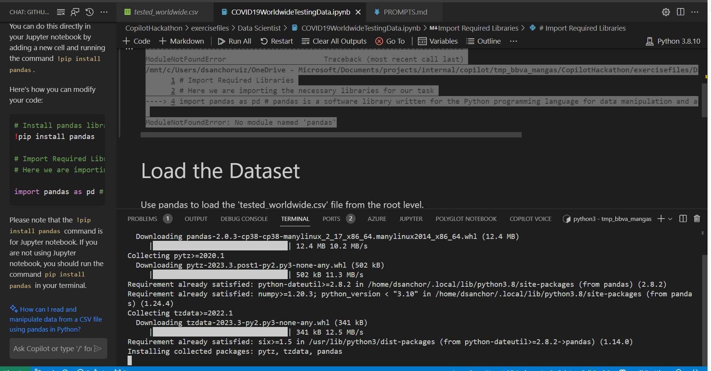

### 1.2 Display the number of rows and columns in the dataframe. 

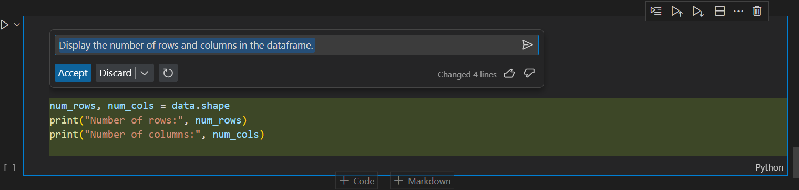

### 1.3 Display the data types of each column

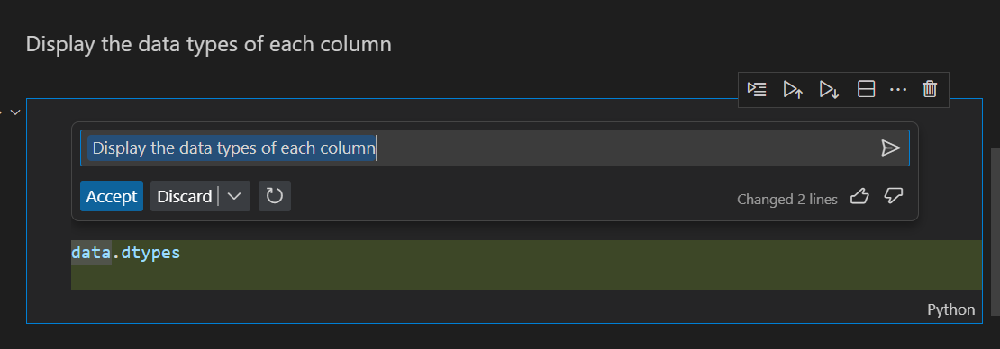

### 1.4 Display the number of missing values in each column

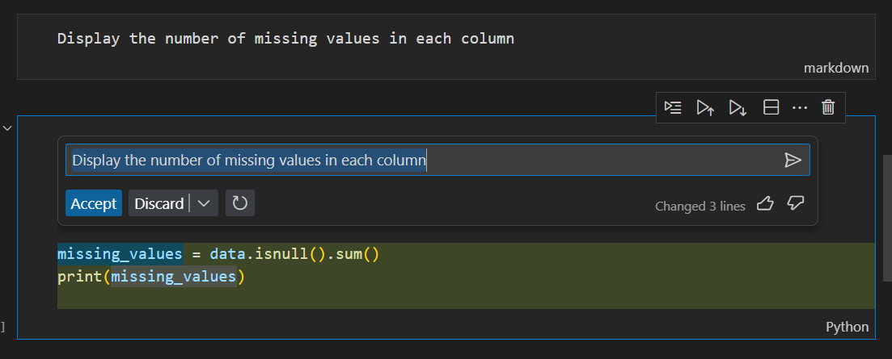

### 1.5 Display the number of unique values in each column

## 2. Data Cleaning

### 2.1 Drop the columns that are not needed for the analysis

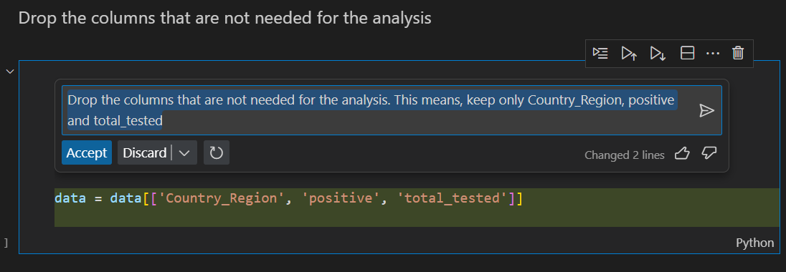

### 2.2 Rename the columns to make them more readable

### 2.3 Drop the rows that have missing values

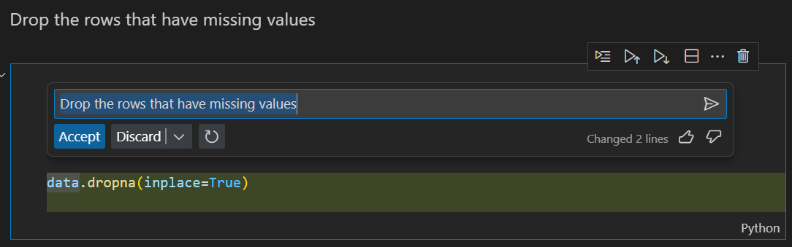

### 2.4 Convert the data types of the columns to the appropriate types

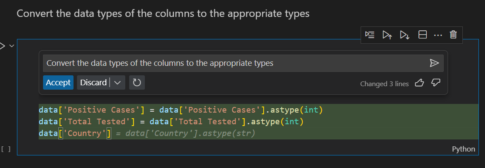

Notice that I have first used the chat, then copilot inline to complete the coversion for the column "Country".

### 2.5 Display the number of missing values in each column

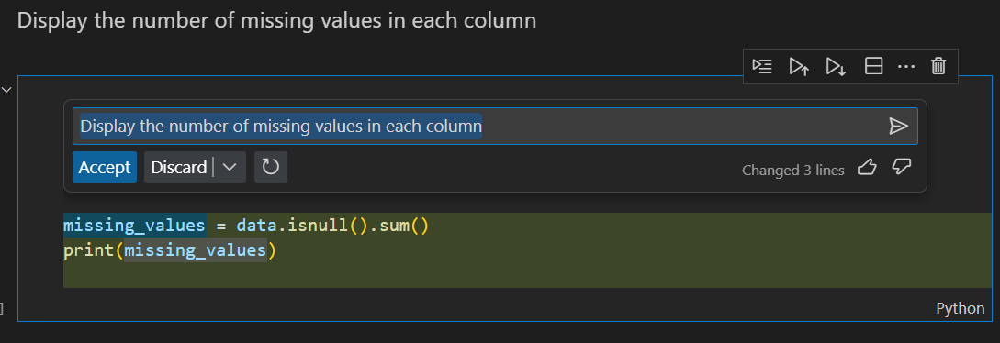

## 3. Extracting the Top Ten Countries with Most Covid-19 Cases

### 3.1 Create a new dataframe that contains the total number of positive cases for each country

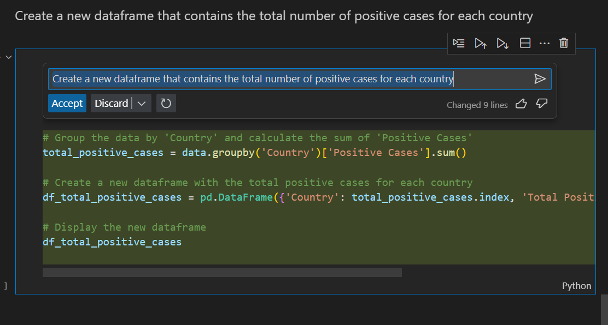

### 3.2 Sort the dataframe in descending order of the total number of positive cases

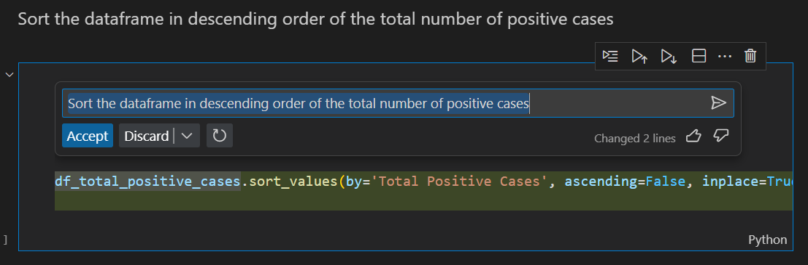

### 3.3 Display the top ten countries with the most positive cases

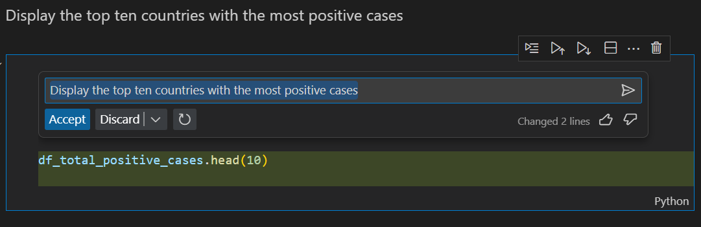

## 4. Identifying the Highest Positive Against Tested Cases

### 4.1 Create a new dataframe that contains the total number of tests conducted for each country

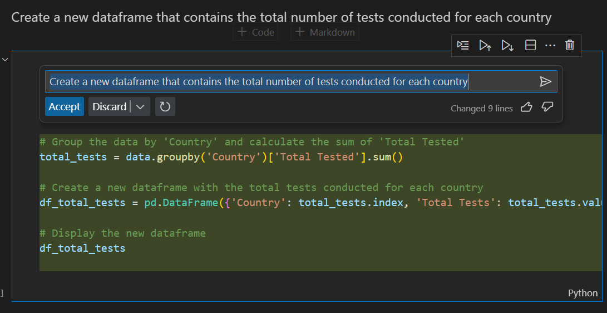

### 4.2 Sort the dataframe in descending order of the total number of tests conducted

### 4.3 Display the top ten countries with the most tests conducted

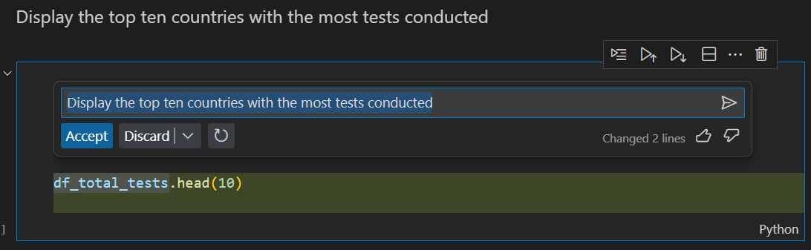

## 5. Identifying top three countries that have had the highest number of positive cases against the number of tests carried out

### 5.1 Merge the two dataframes created in the previous steps

### 5.2 Create a new column that contains the ratio of positive cases to the number of tests conducted

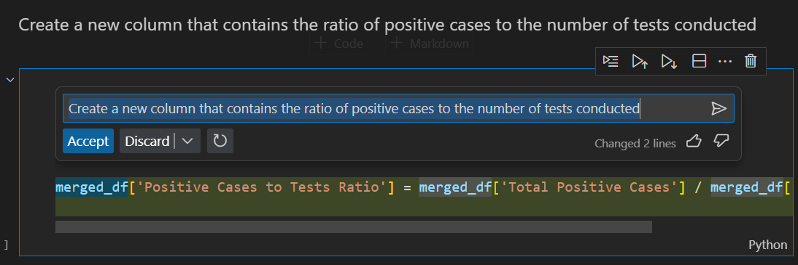

### 5.3 Sort the dataframe in descending order of the ratio of positive cases to the number of tests conducted

### 5.4 Display the top three countries with the highest ratio of positive cases to the number of tests conducted

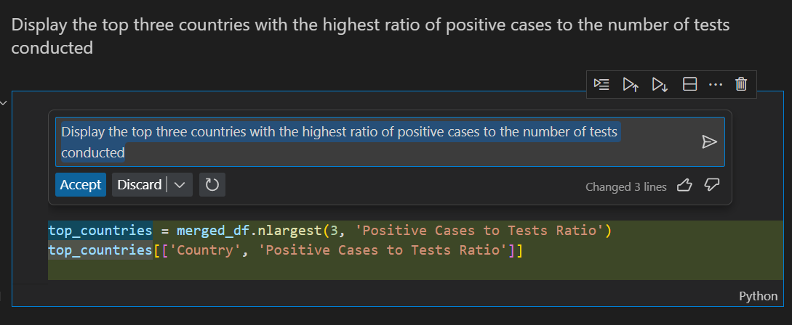

## 6. Displaying the Results

### 6.1 Display the results a chart that shows the top three countries with the highest ratio of positive cases to the number of tests conducted

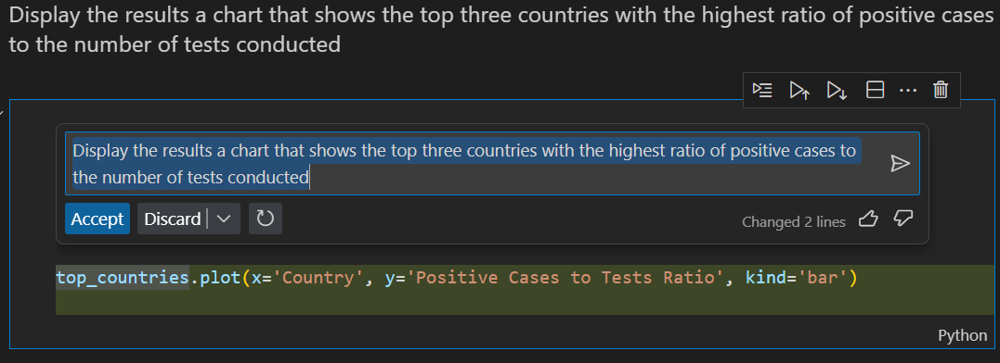

NOTE: In case you get an error related to "ImportError with matplotlib", use copilot inline to help you fixing it:

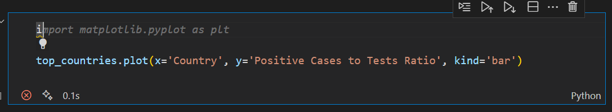

And then, if the module is not found, use copilot chat to help you fixing it:

### 6.2 Display the results in a chart that shows the top ten countries with the most positive cases

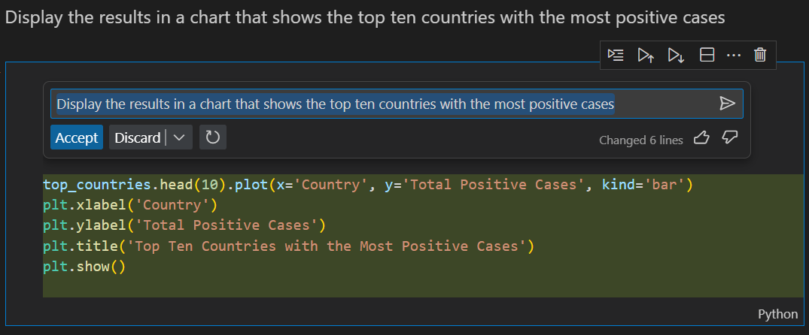

### 6.3 Display the results in a chart that shows the top ten countries with the most tests conducted

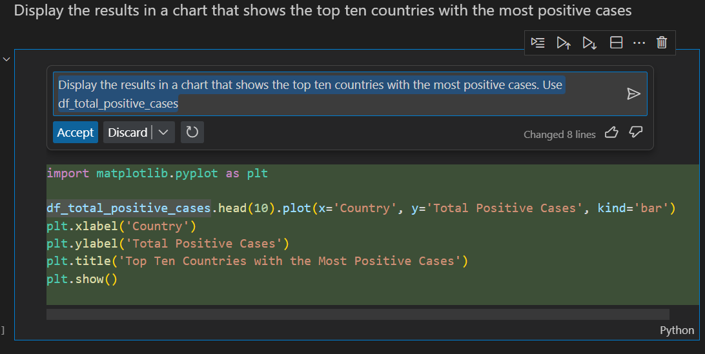

