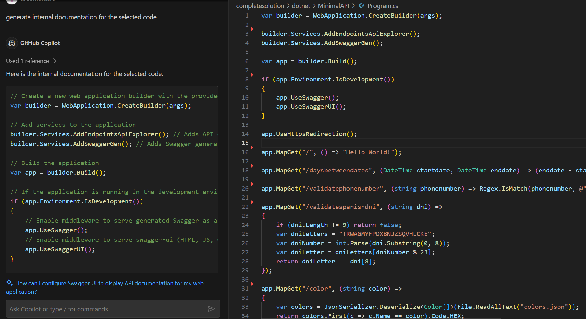
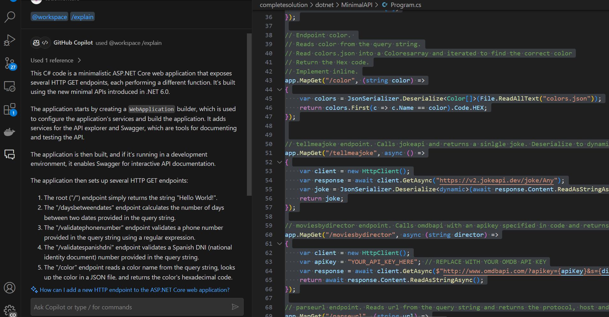
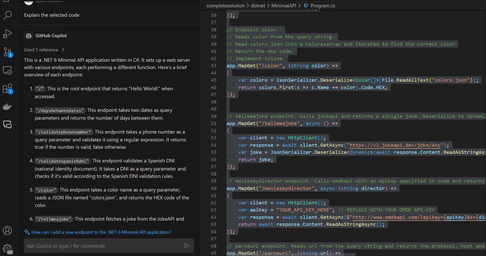

# Exercises tips and tricks

## 3. Document the code

Select the desired code block (or all the code in the file) and write in the Chat prompt: generate internal documentation for the selected code

## 4: Obtain an Explanation of the Code

### 4.1 Obtain Explanation Using Commands

Select the desired code block (or all the code in the file) and write in the Chat prompt: @workspace /explain

### 4.2 Obtain Explanation Without Using Copilot Commands

Select the desired code block (or all the code in the file) and write in the Chat prompt: Explain the selected code

